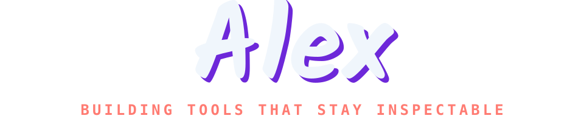

TypeScript / Python developer focused on developer tooling, CLI automation, and reproducible systems. 
主要使用 TypeScript、Python 与 Node.js，专注开发者工具、CLI 自动化和可复现工程工作流。

## Tech stack

  
  
  
  

## Featured work

[Planarian](https://github.com/alexliluz/planarian)  · [ForkNeo](https://github.com/alexliluz/ForkNeo)  · [api-image-neo](https://github.com/alexliluz/api-image-neo) 

## Contribution Signal

<picture>
  <source media="(prefers-reduced-motion: reduce) and (prefers-color-scheme: dark)" srcset="https://raw.githubusercontent.com/alexliluz/alexliluz/output/contribution-signal-dark-static.svg">
  <source media="(prefers-reduced-motion: reduce) and (prefers-color-scheme: light)" srcset="https://raw.githubusercontent.com/alexliluz/alexliluz/output/contribution-signal-light-static.svg">
  <source media="(prefers-color-scheme: dark)" srcset="https://raw.githubusercontent.com/alexliluz/alexliluz/output/contribution-signal-dark.svg">
  <source media="(prefers-color-scheme: light)" srcset="https://raw.githubusercontent.com/alexliluz/alexliluz/output/contribution-signal-light.svg">
  
</picture>

---

[Explore all repositories →](https://github.com/alexliluz?tab=repositories)
