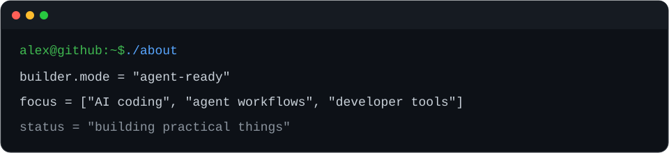

# Hi, I'm Alex / ASEnough.

**I build agent-ready developer tools for AI-assisted software work.**

我在做面向 AI Coding、Agent 工作流和开发者自动化的实用工具。

[Selected Work](#selected-work) · [Now](#now) · [Building Principles](#building-principles) · [Connect](#connect)

## Selected Work

### [Planarian](https://github.com/alexliluz/planarian)

`Experimental` · `Agent Workflow` · `TypeScript` · `UI Engineering`

> Repeatable UI reconstruction workflows designed for coding agents.

Planarian turns UI reconstruction into an inspectable, file-based process with stable session artifacts, task bundles, validation commands, and agent handoffs.

### [ForkNeo](https://github.com/alexliluz/ForkNeo)

`Active` · `CLI` · `GitHub Automation` · `TypeScript`

> Convert GitHub forks into independent repositories while preserving Git history.

ForkNeo safely mirrors branches, tags, default-branch state, and Git LFS objects, then verifies the resulting independent repository.

### [api-image-neo](https://github.com/alexliluz/api-image-neo)

`Active` · `Codex Skill` · `Image Generation` · `Python`

> Image generation for Codex through OpenAI-compatible providers.

The skill supports generation, reference-image workflows, and editing while keeping provider credentials in the user's existing Codex configuration.

## Now

Currently exploring reproducible agent workflows, reusable Codex skills, and practical tools that make AI-assisted development easier to inspect and maintain.

最近在探索可复现的 Agent 工作流、可复用 Codex Skills，以及更透明、更容易维护的 AI Coding 工具。

## Building Principles

- Build tools that remove repeated friction.
- AI workflows should leave inspectable artifacts.
- Useful first, impressive second.

## Working With

`TypeScript` · `Python` · `Vue` · `Node.js` · `GitHub Actions`

## Connect

[GitHub](https://github.com/alexliluz)

---

Building small tools for better human–agent collaboration.
