# Hi, I'm Alex / ASEnough.

我在做更实用、可检查、可复现的 AI Coding 与 Agent 工作流工具。

## Selected Systems

### [01 / Planarian](https://github.com/alexliluz/planarian)

`Experimental` · `Agent Workflow` · `TypeScript`

**Reproducible UI reconstruction workflows for coding agents.**

Planarian turns visual reconstruction into an inspectable process with stable artifacts, task bundles, validation commands, and explicit agent handoffs.

### [02 / ForkNeo](https://github.com/alexliluz/ForkNeo)

`Active` · `CLI` · `GitHub Automation` · `TypeScript`

**Safe fork-to-independent repository migration without losing history.**

ForkNeo preserves branches, tags, default-branch state, and Git LFS objects, then verifies the independent repository.

### [03 / api-image-neo](https://github.com/alexliluz/api-image-neo)

`Active` · `Codex Skill` · `Image Generation` · `Python`

**Provider-flexible image generation workflows for Codex.**

The skill supports generation, reference-image workflows, and editing through OpenAI-compatible providers while reusing existing Codex configuration.

## Contribution City

Daily GitHub activity, rendered as a 3D contribution city.

<picture>
  <source media="(prefers-color-scheme: dark)" srcset="https://raw.githubusercontent.com/alexliluz/alexliluz/output/profile-3d-dark.svg">
  <source media="(prefers-color-scheme: light)" srcset="https://raw.githubusercontent.com/alexliluz/alexliluz/output/profile-3d-light.svg">
  
</picture>

## Operating Signals

### Now

Turning agent demos into repeatable engineering workflows.

把 Agent Demo 变成可复现、可验证、可长期维护的工程工作流。

### Core Stack

`TypeScript` · `Python` · `CLI` · `GitHub Automation` · `Agent Workflows`

### Principles

`Inspectable artifacts` · `Reproducible workflows` · `Useful before impressive`

## Contribution Trail

<picture>
  <source media="(prefers-color-scheme: dark)" srcset="https://raw.githubusercontent.com/alexliluz/alexliluz/output/contribution-snake-dark.svg">
  <source media="(prefers-color-scheme: light)" srcset="https://raw.githubusercontent.com/alexliluz/alexliluz/output/contribution-snake-light.svg">
  
</picture>

---

[Explore all repositories →](https://github.com/alexliluz?tab=repositories)
